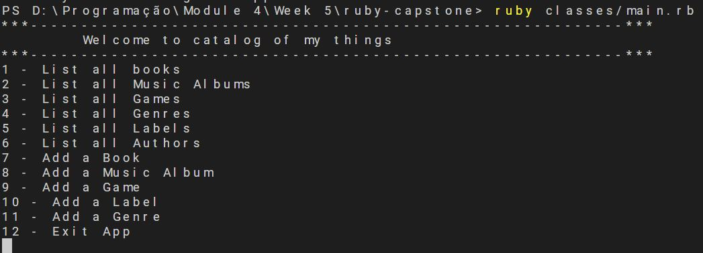
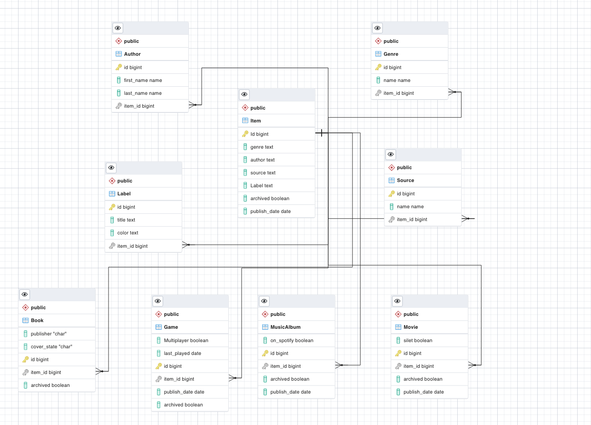

# Catalog of my things - Ruby capstone
 This is the Catalog of my things app initiated in the fifth week of the fourth module in the Microverse program. It is a simple database app to catalog entertainment content (Books, Music, Games).

## Built With


- Visual Studio Code
- Ruby
- Rspec

 ## App ScreenShot
  
 ## Video Preview

 [Video](https://drive.google.com/file/d/110VmfAqCoTOFljt-ZpIAKRhu2BTzVX_4/view?usp=sharing)

 ## SQL schema
   


## Getting Started

To get a local copy up and running follow these simple steps.

### Prerequisites

- [x] A code editor like Visual Studio Code with Git and Ruby.

You can check if Git is installed by running the following command in the terminal.
```
$ git --version
```

Likewise for Ruby installation.
```
$ ruby --version && irb
```

### Setup

Clone the repository using the GitHub link provided below.

### Install

In the terminal, go to your file directory and run this command.

```
$ git clone https://github.com/lucas-crodrigues/ruby-capstone.git
```
```
$ cd ruby-capstone
```
```
$ bundle install
```
```
$ ruby ./classes/main.rb
```

### Run tests

To install rspec, in the terminal kindly run this command

```
$ gem install rspec
```

To run tests, please run this command

```
$ rspec ./spec/#{filename}_spec.rb
```

## Authors

👤 **Ja'fer Yousef**

- GitHub: [@jaferIdrees](https://github.com/jaferIdrees)

- Twitter: [@jafel_l](https://twitter.com/jafel_l)

- LinkedIn: [Ja'fer Yousef](https://linkedin.com/in/jaferll)


👤 **Lucas Costa Rodrigues**

- GitHub: [@lucas-crodrigues](https://github.com/lucas-crodrigues)

- Twitter: [@lcrodrigues58](https://twitter.com/lcrodrigues58)

- LinkedIn: [Lucas Costa Rodrigues](https://www.linkedin.com/in/lucascostarodrigues/)

👤 **Nimrod Acosta**

- GitHub: [nimplay](https://github.com/nimplay)

- Twitter: [NimrodAcosta](https://twitter.com/NimrodAcosta)

- LinkedIn: [nimrod-acosta](https://www.linkedin.com/in/nimrod-acosta-734330169/)

## 🤝 Contributing

Contributions, issues, and feature requests are welcome!

Feel free to check the [issues page](../../issues/).

## Show your support
Give a ⭐️ if you like this project!

## Acknowledgments

- [Microverse](https://github.com/microverseinc) team.
- Coding Partners.
- Code Reviewers.

## 📝 License

This project is [MIT](./LICENSE) licensed.
